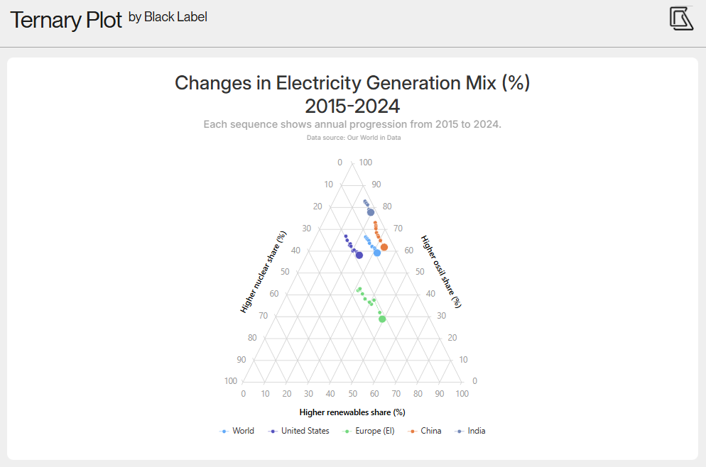

# Ternary Plot – Highcharts Plugin

[](https://www.npmjs.com/package/highcharts-ternary-plot)
[](types/index.d.ts)
[](LICENSE)

**Ternary Plot** is an official [Black Label](https://blacklabel.net/highcharts/) plugin for Highcharts, extending the charting library with support for ternary charts used to visualize data composed of three interdependent values that sum to a constant (typically 100%). Each data point represents a composition of three components and is plotted within a triangular coordinate system, making it easy to compare proportions and relationships between them. The plugin is built as a separate add-on to [Highcharts](https://www.highcharts.com/), a charting library owned and maintained by Highsoft AS.

This plugin is the result of our long-standing collaboration with Highsoft, where we’ve been a trusted partner since 2010 — helping build, maintain, and expand the Highcharts ecosystem. With Ternary Plot, you can easily present complex three-component datasets in a clear and interactive way, without relying on custom implementations or workarounds.

Ternary charts are commonly used in fields where data is expressed as proportions of three components: geology (soil composition), chemistry (phase diagrams), materials science, nutrition (macronutrient ratios), or market research (share of three competing options).

➖ [Live demo](https://blacklabel.github.io/highcharts-ternary-plot/)  
➖ [GitHub repository](https://github.com/blacklabel/highcharts-ternary-plot)



---

## Table of Contents
- [Getting Started](#getting-started)
  - [Compatibility](#compatibility)
  - [Installation](#installation)
- [Minimal Code](#minimal-code)
- [TypeScript](#typescript)
- [Available Options](#available-options)
- [Migrating from v1 to v2](#migrating-from-v1-to-v2)
- [Development Setup](#development-setup)

## Getting Started

### Compatibility

| Ternary Plot Version | Highcharts Version |
| -------------------- | ------------------ |
| **2.0.0**            | `12.0.0+`          |

### Browser Support

All modern evergreen browsers are supported: Chrome, Firefox, Safari, Edge. Internet Explorer is not supported.

### Installation

Install via NPM:

```bash
npm install highcharts highcharts-ternary-plot
# or
yarn add highcharts highcharts-ternary-plot
# or
pnpm add highcharts highcharts-ternary-plot
```

Then import and initialize:
```js
import Highcharts from "highcharts";
import HighchartsTernaryPlot from "highcharts-ternary-plot";

HighchartsTernaryPlot(Highcharts);
```

Or include via a `<script>` tag after loading Highcharts:
```html
<script src="https://code.highcharts.com/highcharts.js"></script>
<script src="https://cdn.jsdelivr.net/npm/highcharts-ternary-plot/js/ternary-plot.js"></script>
```

## Minimal Code

Enable `chart.ternary` and add a `ternaryscatter` series with three-dimensional data:
```js
Highcharts.chart('container', {

  chart: {
    ternary: true
  },

  series: [{
    type: 'ternaryscatter',
    data: [
      [20, 70, 10],
      [30, 40, 30],
      [20, 35, 45],
      [15, 35, 50],
      [20, 20, 60],
      [0, 100, 0]
    ]
  }]

});
```

## TypeScript

Type declarations are included in the package — no separate `@types` install needed. Importing the plugin automatically augments the Highcharts module with all ternary-specific types (`TernaryOptions`, `TernaryPointOptions`, `SeriesTernaryScatterOptions`, etc.).

```ts
import Highcharts from 'highcharts';
import HighchartsTernaryPlot from 'highcharts-ternary-plot';

HighchartsTernaryPlot(Highcharts);

Highcharts.chart('container', {
  chart: {
    ternary: {
      angle: 60,
      spacing: 40,
      sumTo: 100
    }
  },
  series: [{
    type: 'ternaryscatter',
    componentColors: {
      a: '#e74c3c',
      b: '#2ecc71',
      c: '#3498db'
    },
    data: [
      { a: 20, b: 10, c: 70 },
      { a: 80, b: 15, c: 5 },
      { a: 95, b: 3, c: 2 },
    ]
  }]
});
```

## Available Options

### `chart.ternary`

`boolean | object` — Enable and configure the ternary coordinate system. Set to `true` to use all defaults, or pass an options object.

| Option                  | Type      | Default | Description                                                                                     |
| ----------------------- | --------- | ------- | ----------------------------------------------------------------------------------------------- |
| `chart.ternary`         | `boolean \| TernaryOptions` | — | Enable ternary mode. |
| `chart.ternary.enabled` | `boolean` | `true`  | Set to `false` to disable while keeping the configuration object.                               |
| `chart.ternary.angle`   | `number`  | `60`    | Angle in degrees between the base and sides of the triangle. `60` produces an equilateral shape. Must be in the range (0, 90). |
| `chart.ternary.spacing` | `number`  | `35`    | Pixel padding applied uniformly around the triangle. Increase to make room for axis labels.     |
| `chart.ternary.sumTo`   | `number`  | `100`   | The value that the three components must sum to. Use `1` for fractions, `100` for percentages.  |

---

### `ternaryAxis`

`object` — Configure the three axes. `plotOptions` applies to all axes; `a`, `b`, `c` allow per-axis overrides.

#### Structure

| Option                    | Description                               |
| ------------------------- | ----------------------------------------- |
| `ternaryAxis.plotOptions` | Shared options applied to all three axes. |
| `ternaryAxis.a`           | Options for the bottom axis (A).          |
| `ternaryAxis.b`           | Options for the right axis (B).           |
| `ternaryAxis.c`           | Options for the left axis (C).            |

#### Grid lines

| Option                  | Type     | Default    | Description                                                    |
| ----------------------- | -------- | ---------- | -------------------------------------------------------------- |
| `tickInterval`          | `number` | `50`       | Interval between grid lines.                                   |
| `gridLineColor`         | `string` | `#d6d6d6`  | Color of the internal grid lines.                              |
| `gridLineWidth`         | `number` | `1`        | Width of the internal grid lines in pixels.                    |
| `gridLineDashStyle`     | `string` | `'Solid'`  | Dash style of the internal grid lines (`DashStyleValue`).      |
| `gridLineExtension`     | `number` | `0`        | Extends grid lines beyond the triangle edges, in pixels.       |

#### Triangle sides (axis lines)

| Option          | Type     | Default   | Description                                             |
| --------------- | -------- | --------- | ------------------------------------------------------- |
| `lineColor`     | `string` | `#d6d6d6` | Color of the triangle sides.                            |
| `lineWidth`     | `number` | `1`       | Width of the triangle sides in pixels.                  |
| `lineDashStyle` | `string` | `'Solid'` | Dash style of the triangle sides (`DashStyleValue`).    |

#### Median lines

| Option               | Type                | Default   | Description                                                                            |
| -------------------- | ------------------- | --------- | -------------------------------------------------------------------------------------- |
| `median`             | `boolean \| object` | —         | Show or configure median lines (vertex → midpoint of opposite side).                   |
| `median.color`       | `string`            | `#d6d6d6` | Color of the median lines.                                                             |
| `median.width`       | `number`            | `1`       | Width of the median lines in pixels.                                                   |
| `median.dashStyle`   | `string`            | `'Solid'` | Dash style of the median lines (`DashStyleValue`).                                     |

#### Labels

| Option           | Type      | Description                                              |
| ---------------- | --------- | -------------------------------------------------------- |
| `labels.enabled` | `boolean` | Show or hide tick labels.                                |
| `labels.style`   | `object`  | CSS style object applied to label text.                  |
| `labels.margin`  | `number`  | Distance between labels and the triangle edge, in pixels.|

#### Title

| Option                  | Type                          | Description                                                       |
| ----------------------- | ----------------------------- | ----------------------------------------------------------------- |
| `title.text`            | `string`                      | Axis title text.                                                  |
| `title.style`           | `object`                      | CSS style object applied to the title.                            |
| `title.margin`          | `number`                      | Distance between the title and the triangle edge, in pixels.      |
| `title.titlePosition`   | `'corner' \| 'side'`          | Position of the title relative to the triangle.                   |
| `title.offsetDirection` | `'horizontal' \| 'perpendicular'` | Direction the title offsets from its axis edge.               |
| `title.rotation`        | `number`                      | Title rotation in degrees. Overrides the automatic rotation.      |

---

### Series: `ternaryscatter`

Set `series.type` to `'ternaryscatter'`. Data points accept `[a, b, c]` arrays or objects with `a`, `b`, `c` properties. The `c` value may be omitted — it is derived as `sumTo - a - b`.

| Option                      | Type                     | Description                                                                                                    |
| --------------------------- | ------------------------ | -------------------------------------------------------------------------------------------------------------- |
| `series.minSize`            | `number`                 | Minimum marker radius in pixels for bubble sizing. Requires `maxSize`.                                         |
| `series.maxSize`            | `number`                 | Maximum marker radius in pixels for bubble sizing. Requires `minSize`.                                         |
| `series.componentColors`    | `object`                 | Barycentric color blending — each point's color is interpolated from the three corner colors by its a/b/c values. |
| `componentColors.a`         | `string`                 | Color at the A vertex.                                                                                         |
| `componentColors.b`         | `string`                 | Color at the B vertex.                                                                                         |
| `componentColors.c`         | `string`                 | Color at the C vertex.                                                                                         |
| `componentColors.alpha`     | `number`                 | Opacity applied to all points (`0`–`1`). Overrides any alpha in the color strings.                            |

## Migrating from v1 to v2

v2.0.0 introduces three breaking changes.

### 1. Data keys renamed: `x`, `y`, `z` → `a`, `b`, `c`

Series data and tooltip point references use the new key names.

```js
// v1
data: [[10, 60, 30], [20, 50, 30]]
// tooltip: point.x, point.y, point.z

// v2
data: [[10, 60, 30], [20, 50, 30]]  // array order unchanged
// tooltip: point.a, point.b, point.c
```

Object notation also changed:

```js
// v1
{ x: 10, y: 60, z: 30 }

// v2
{ a: 10, b: 60, c: 30 }
```

### 2. `ternaryAxis` changed from an array to an object

```js
// v1
ternaryAxis: [
  { tickInterval: 10, title: { text: 'A' } },
  { tickInterval: 10, title: { text: 'B' } },
  { tickInterval: 10, title: { text: 'C' } }
]

// v2
ternaryAxis: {
  plotOptions: { tickInterval: 10 },  // shared options (optional)
  a: { title: { text: 'A' } },
  b: { title: { text: 'B' } },
  c: { title: { text: 'C' } }
}
```

### 3. `chart.ternarySpacing` moved into `chart.ternary`

```js
// v1
chart: {
  ternary: true,
  ternarySpacing: 35
}

// v2
chart: {
  ternary: {
    spacing: 35
  }
}
```

## Development Setup

If you want to work on this plugin locally:

1. Clone the repository
```bash
git clone https://github.com/blacklabel/highcharts-ternary-plot.git
cd highcharts-ternary-plot
```
2. Install dependencies
```bash
npm install
# or
yarn install
```
3. Build the plugin
```bash
npm run build
```
The compiled file will be available as `js/ternary-plot.js`.

Available commands:

| Command               | Description                              |
| --------------------- | ---------------------------------------- |
| `npm run build`       | Compile and bundle the plugin            |
| `npm run build:watch` | Rebuild automatically on file changes    |
| `npm run typecheck`   | Run TypeScript type checking             |
| `npm test`            | Run tests                                |
| `npm run lint`        | Lint TypeScript source files             |
| `npm run lint:fix`    | Lint and auto-fix TypeScript source files |

After building, load `js/ternary-plot.js` after Highcharts in your HTML to test locally.

## Why Black Label Built This Plugin

At Black Label, we specialize in pushing the boundaries of data visualization. Over the past 15 years, we’ve worked with companies worldwide to build charting solutions that go beyond out-of-the-box libraries.

Highcharts is at the heart of much of our work, and this plugin grew directly out of real-world client needs:

- Visualizing compositional data using ternary charts  
- Extending Highcharts with native ternary axes and series types

**Ternary Plot** is one of many plugins we’ve created to make Highcharts more flexible, more powerful, and more developer-friendly.


## About Black Label

We’re a Krakow-based team of data visualization experts, working closely with Highsoft and the global Highcharts community since 2010. Our expertise spans plugins, extensions, custom dashboards, and full-scale dataviz applications.

Ternary Plot is just one of the many innovations we’ve open-sourced. Explore more on our [GitHub profile](https://github.com/blacklabel), read insights on our [Blog](https://blacklabel.net/blog/), or connect with us at **tech@blacklabel.net** to discuss how we can help bring your charts and dashboards to life.  

➖ Learn more on our [LinkedIn page](https://www.linkedin.com/company/black-label).
